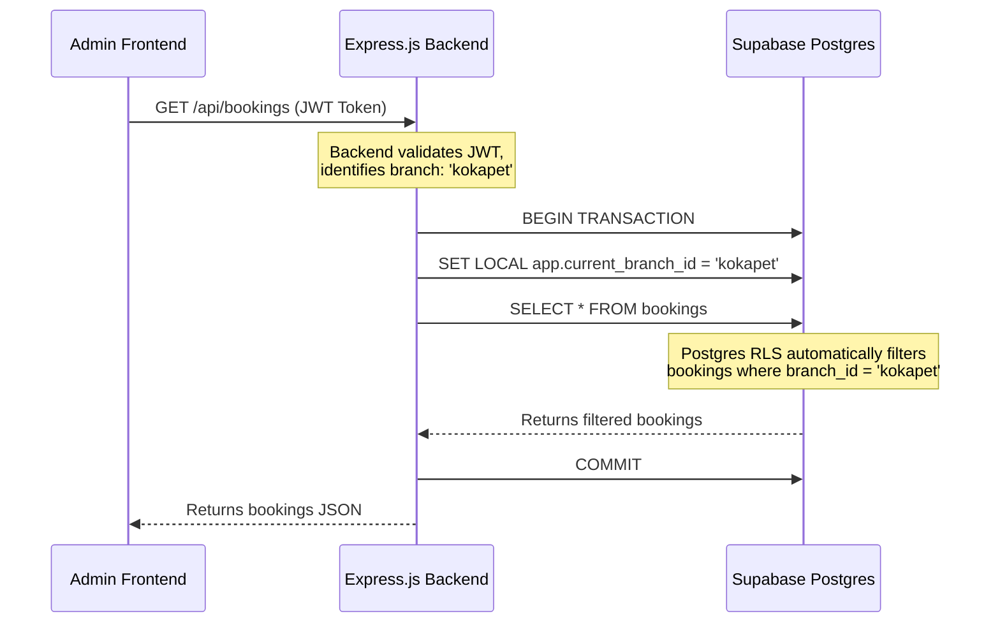

# Dome Cafe — Row-Level Security (RLS) & Multi-Tenant Isolation

This document outlines the design decisions and implementation details for enforcing **multi-tenant data isolation** between branches (Kokapet and Sainikpuri) using Row-Level Security (RLS) in PostgreSQL.

---

## 🎯 Why Option B (Session-Variable RLS) Was Selected

We have selected **Option B (Custom Express Auth Service + Session-Variable RLS)** for the Dome Cafe Digital Management System. This choice aligns directly with the core architectural principle of the system: **Full Decoupling**.

### 1. Adherence to Decoupled Architecture
Under our decoupled model, the database must remain a dumb storage layer, and the authentication system must be fully managed by our backend services. By avoiding Supabase-native authentication (`auth.users`), we prevent vendor lock-in. The backend handles identity, and the database handles storage and security verification.

### 2. Complete Database Portability
Option B uses standard PostgreSQL commands (`SET LOCAL` and `current_setting`). This means the database is **100% portable**. If we decide to migrate from Supabase to AWS RDS, Google Cloud SQL, Neon, or a self-hosted Postgres container on a VPS, the RLS policies and application code will work instantly without changes.

### 3. Custom WhatsApp & SMS OTP Authentication
Our booking process requires authentication via WhatsApp OTP with SMS fallback. Integrating this custom authentication flow natively with Supabase Auth can be rigid and complex. Having a custom Express.js auth service allows us to build a tailored OTP verification pipeline, generate standard JWTs, and handle fallback routes.

---

## 📐 How the Implementation Works

In Option B, the database does not know which user is querying. Instead, the Express backend sets a temporary **session-level configuration parameter** (`app.current_branch_id`) for the duration of a database transaction. The Postgres database engine reads this parameter to filter rows.



---

## 🛠️ Step-by-Step Implementation Guide

### Step 1: Create the RLS Migration File

To enable RLS and create the policies on the database, we run the following SQL statements. This is added to our migrations:

```sql
-- 1. Enable RLS on multi-tenant tables
ALTER TABLE "bookings" ENABLE ROW LEVEL SECURITY;

-- 2. Create a Policy for Bookings
-- Allows operations only if the booking's branch_id matches the session variable
CREATE POLICY bookings_branch_isolation_policy ON "bookings"
  FOR ALL
  USING (
    branch_id = current_setting('app.current_branch_id', true)
  );
```

> [!NOTE]
> The second parameter `true` in `current_setting('app.current_branch_id', true)` is critical. It prevents Postgres from throwing an error if the variable hasn't been set yet (returning `NULL` instead, which safely denies access).

---

### Step 2: Implementation in Express.js (with Drizzle ORM)

In the Express backend, database operations for branch admins must be wrapped in a transaction block. We set the session variable first, and then run our queries.

Here is an example implementation using **Drizzle ORM**:

```typescript
import { db } from './db'; // Drizzle client instance
import { bookings } from './db/schema';
import { eq, sql } from 'drizzle-orm';

export async function getBranchBookings(branchId: string) {
  // All queries must execute inside a transaction block
  return await db.transaction(async (tx) => {
    // 1. Set the local configuration variable for this transaction
    await tx.execute(
      sql`SET LOCAL app.current_branch_id = ${branchId}`
    );

    // 2. Run your query as usual. Postgres handles filtering automatically.
    // Even if you write "select all", only this branch's bookings will be returned.
    const result = await tx.select().from(bookings);
    
    return result;
  });
}
```

---

### Step 3: Super-Admin Bypass

Super-admins (such as executive developers or owners) need to view bookings across *all* branches. To allow this:

1. **Option A (App-level bypass):** The Express backend can connect to the database using the database owner/superuser credential (which automatically bypasses RLS policies).
2. **Option B (Session-level bypass):** We define the policy to allow a special super-admin override value:

```sql
CREATE POLICY bookings_branch_isolation_policy ON "bookings"
  FOR ALL
  USING (
    current_setting('app.current_role', true) = 'super_admin'
    OR branch_id = current_setting('app.current_branch_id', true)
  );
```

Then in Express, a Super Admin query is executed as:
```typescript
await db.transaction(async (tx) => {
  await tx.execute(sql`SET LOCAL app.current_role = 'super_admin'`);
  return await tx.select().from(bookings); // Returns all rows
});
```

---

## 🔒 Verification & Best Practices

1. **Transaction Scoping:** Always use `SET LOCAL` (instead of `SET`). `SET LOCAL` guarantees that the variable is automatically cleared the moment the transaction commits or rolls back, ensuring it doesn't bleed into other pooled connections.
2. **Connection Pools:** Ensure that database transactions are executed on the same connection. Wrapping the queries in a `db.transaction()` block guarantees that Drizzle executes the commands sequentially on a single client connection.
